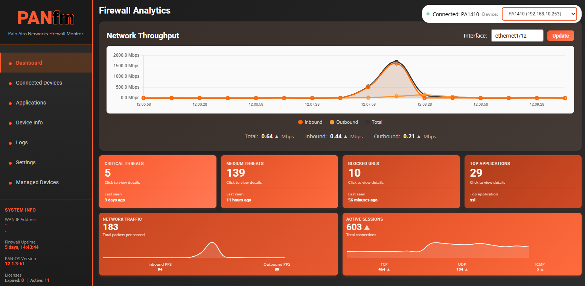

# PANfm - Palo Alto Networks Firewall Monitor


A real-time monitoring dashboard for Palo Alto Networks firewalls with automated PAN-OS upgrades, intelligent alerting, and multi-device support. Features a dual-process architecture with dedicated background scheduler for data collection and alert monitoring. This is a POC experiment to see how agentic AI can help bring ideas to life.

<p align="center">
  
</p>

## Quick Start

### Prerequisites
- Docker and Docker Compose

### Choose Your Branch

PANfm uses a two-branch workflow:
- **`main` branch** - Stable production releases (recommended for deployment)
- **`test` branch** - Active development (for contributors and testing)

For production use, clone `main`.

### Deploy with Docker

```bash
# Clone the repository (main branch - stable)
git clone https://github.com/csmblade/panfm.git
cd panfm

# IMPORTANT: First-time setup - Create required files BEFORE starting Docker
# This prevents Docker from creating directories instead of files
chmod +x setup.sh
./setup.sh

# Start the application
docker compose up -d

# View logs
docker compose logs -f
```

**CRITICAL:** Always run `./setup.sh` BEFORE `docker compose up`. If you skip this step, Docker will create directories instead of files for the volume mounts, causing the application to fail.

**Note:** The `setup.sh` script creates:
- `settings.json` - Default application settings
- `devices.json` - Empty device list
- `encryption.key` - Encryption key for sensitive data
- `auth.json` - User authentication data (default: admin/admin)
- `device_metadata.json` - Device metadata storage (encrypted)
- `mac_vendor_db.json` - MAC vendor database (upload via Settings)
- `service_port_db.json` - Service port database (upload via Settings)
- `alerts.db` - SQLite database for alert history
- `throughput_history.db` - SQLite database for throughput metrics
- `data/` - Data directory

The dashboard will be available at **http://localhost:3000**

### Dual-Process Architecture

PANfm v1.10.0 uses a **dual-process architecture** for improved performance and reliability:

**Web Process (`panfm`):**
- Serves the web dashboard on port 3000
- Handles user requests and displays data
- Read-only access to databases (no scheduled tasks)

**Clock Process (`panfm-clock`):**
- Dedicated APScheduler background service
- Collects throughput data every minute
- Monitors alerts and triggers notifications
- Manages database writes and data retention

Both processes share SQLite databases (`throughput_history.db`, `alerts.db`) with proper locking to prevent conflicts.

### First Login

**Default Credentials:**
- Username: `admin`
- Password: `admin`

**IMPORTANT:** You will be required to change the default password on first login.

## Updating the Application

When you update the code (git pull), restart the Docker container:

```bash
# Quick restart (preserves data)
docker compose restart

# Full rebuild (if dependencies changed)
docker compose down
docker compose up -d --build
```

### Troubleshooting Login Issues After Update

If you get 401 errors after updating from an older version, your auth.json may need to be migrated to the new structure:

```bash
chmod +x fix-auth.sh
./fix-auth.sh
```

This will reset your credentials to the default `admin/admin`.

### Windows Users

Use the provided batch scripts for convenience:

```cmd
quick-restart.bat      # Quick restart (keeps data)
restart-docker.bat     # Full restart (clears volumes)
```

## Local Development & Testing

### Test Before Committing (Docker Desktop)

**For Windows developers using Docker Desktop**, you can test changes locally before pushing to GitHub:

```cmd
# 1. Make your code changes in your editor

# 2. Test locally with Docker Desktop
local-test.bat

# 3. Test in browser at http://localhost:3000
#    - Verify all features work
#    - Check browser console for errors (F12)
#    - Verify Services tab shows APScheduler/Database status

# 4. If everything works, commit and push
docker compose down
git add .
git commit -m "Your commit message"
git push origin test
```

**What `local-test.bat` does**:
- ✅ Checks Docker Desktop is running
- ✅ Rebuilds image with your latest code
- ✅ Starts fresh container on port 3000
- ✅ Opens browser automatically
- ✅ Shows testing checklist

**Detailed Setup Guide**: See [DOCKER_SETUP.md](DOCKER_SETUP.md) for complete Docker Desktop setup instructions, troubleshooting, and advanced commands.

### Quick Development Scripts

| Script | Purpose | Data |
|--------|---------|------|
| `local-test.bat` | **Full test before commit** | Fresh |
| `quick-restart.bat` | Quick code changes | Kept |
| `restart-docker.bat` | Clean state needed | Cleared |

## Data Persistence

The following data persists across container restarts:
- `encryption.key` - Encryption key (DO NOT LOSE THIS)
- `settings.json` - Application settings (encrypted)
- `devices.json` - Firewall device configurations (encrypted)
- `auth.json` - User authentication data (encrypted)
- `device_metadata.json` - Device custom names, tags, locations (encrypted)
- `mac_vendor_db.json` - MAC vendor database (6.7MB, optional)
- `service_port_db.json` - Service port database (851KB, optional)

**IMPORTANT:** Backup `encryption.key` securely. Losing it means losing access to all encrypted data.

### Optional Databases

Download and upload via **Settings > Databases**:
- **MAC Vendor Database**: [maclookup.app](https://maclookup.app/downloads/json-database) - Shows manufacturer names for MAC addresses
- **Service Port Database**: Upload your own JSON mapping of port numbers to service names

## Features

### Core Monitoring
- **Multi-device firewall monitoring** - Manage multiple PA firewalls from one dashboard
- **Database-first architecture** - SQLite databases with 1-minute automated updates
- **Historical throughput and system metrics** - Advanced charting with time range selection
- **Real-time traffic and threat log analysis** - Live monitoring and analysis
- **Connected devices tracking** - ARP table monitoring with custom names, tags, and locations
- **DHCP lease monitoring** - Track DHCP assignments and hostname mappings

### Intelligent Alerting (v1.9.0)
- **9 Pre-built Alert Templates** - CPU, memory, sessions, threats, interface errors, and more
- **4 Quick-Start Scenarios** - Get started in minutes with common alert configurations
- **Multi-Channel Notifications** - Email (SMTP) and webhook support
- **Flexible Scheduling** - Per-alert schedules with business hours support
- **Alert History & Acknowledgment** - Track all alerts with SQLite database
- **Test Notifications** - Validate your SMTP/webhook configuration before deployment

### Operations & Management
- **Automated PAN-OS Upgrades** - 5-step workflow with progress tracking and reboot monitoring
- **Content Update Management** - Automated content package installation
- **Backup & Restore System** - Full system backup including encryption keys and metadata
- **Security Policy Management** - View and analyze firewall policies

### Security & Deployment
- **Dual-Process Architecture** - Separate web and scheduler processes for reliability
- **All sensitive data encrypted at rest** - Fernet (AES-128) encryption
- **CSRF protection** - Secure against cross-site request forgery
- **Rate limiting** - Protect against abuse and API overload
- **Docker + CLI deployment** - Deploy with Docker Compose or native Python
- **bcrypt authentication** - Secure password hashing with session management

## Support & Troubleshooting

### Check Application Logs

For issues or questions, check the application logs:

```bash
# View both processes
docker compose logs -f

# View web process only
docker compose logs -f panfm

# View clock process only
docker compose logs -f panfm-clock
```

Enable debug logging in the Settings page for detailed troubleshooting.

### Clock Process Not Running

If throughput data or alerts aren't updating, check if the clock process is running:

```bash
# Check running containers
docker compose ps

# You should see both:
# - panfm        (web process, port 3000)
# - panfm-clock  (background scheduler)
```

If `panfm-clock` is not running:

```bash
# Restart the clock process
docker compose restart panfm-clock

# Or rebuild if there are code changes
docker compose up -d --build panfm-clock
```

**Symptoms of clock process issues:**
- Throughput charts show "No data available"
- Alerts not triggering despite conditions being met
- Services page shows "APScheduler: Not Running"
- Last collection time not updating

### Database Locking Issues

If you see "database is locked" errors:

1. **Check both processes are running** - Database locking is normal when both processes share SQLite
2. **Restart both containers** - `docker compose restart`
3. **Check disk space** - Ensure sufficient space for database writes

### Alert Notifications Not Sending

If alerts are configured but not sending:

1. **Test your SMTP/webhook settings** - Use the "Test Notification" button in Settings
2. **Check clock process logs** - `docker compose logs panfm-clock | grep -i alert`
3. **Verify alert is enabled and scheduled** - Check alert configuration in Alerts page
4. **Check notification channel is configured** - Settings > Notifications

## Branches

- **`main`** - Stable production releases, tagged versions
- **`test`** - Active development, latest features

## License

MIT License - See LICENSE file for details

---

Built for network security professionals
